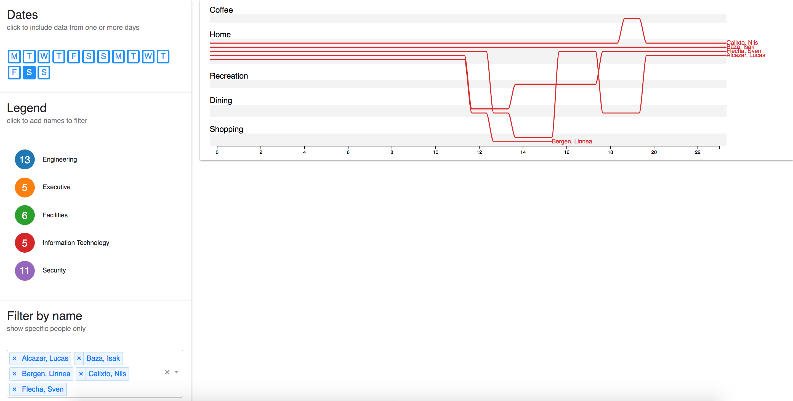

# [Live Demo](https://pnnl.github.io/sven/)

# What does this do?
This is a demo of storyline visualization applied to a subset of the [VAST Challenge 2014 MC2 dataset](http://www.vacommunity.org/VAST+Challenge+2014%3A+Mini-Challenge+2), that uses our new design guidelines proposed in [1].
The visualization helps explain patterns of life by showing when two or more entities have the same state at the same time. Time is encoded on the x-axis and state is encoded on the y-axis.



You can click on days or employment groups to change the filter, which will only show storylines for the given entities. You can shift + click to add names to the filter without replacing the existing set of names. In the visualization, you can also click on an individual storyline to set the filter to that name, or a location to set the filter to all the names passing through that location.

Try adding a single name to the filter, then add all the weekdays or weekends to see how a person's behavior varies subtly. **Be careful that you don't clear the filter with many days selected, this will cause the browser choke while trying to layout too many storylines**.

# Running the Demo
This demo is powered by `create-react-app`. See `README (create-react-app).md` for detailed instructions. The simple, short way to run the demo is to install node.js and perform the following commands in the project root (where the package.json lives):

```js
npm install -g serve
serve -s build
```

This repository contains the webpacked producction version of the demo that makes this possible. Alternatively, the demo can be run by getting the development environment working. This has a higher chance of failure, but can be done with the following commands:

```js
npm install
npm start
```

# Using the Layout Library
## Input
The input format is flexible (see below) but should at a minimum be an array of objects, where each object contains the following information:
* A unique identifier for each entity to be drawn as a storyline. In this example it's "name"
* The state of the entity. In this case it's "activity" 
* A time window. In this example it's "hour"

Here's a snippet of the input data from our analysis of the [VAST Challenge 2014 MC2](http://www.vacommunity.org/VAST+Challenge+2014%3A+Mini-Challenge+2) dataset.

```json
[{"activity": "Home",
  "date": "2014-01-06 00:00:00",
  "hour": 21,
  "name": "Alcazar, Lucas"},
 {"activity": "GASTech",
  "date": "2014-01-06 00:00:00",
  "hour": 11,
  "name": "Alcazar, Lucas"},
 {"activity": "GASTech",
  "date": "2014-01-06 00:00:00",
  "hour": 10,
  "name": "Alcazar, Lucas"},
 {"activity": "Dining",
  "date": "2014-01-06 00:00:00",
  "hour": 12,
  "name": "Alcazar, Lucas"}]
```
## Layout
To generate a storyline layout from this data, create a layout object and define the accessor functions as appropriate. In our case we create a unique storyline for each `name x date` pair.

```js
import SvenLayout from './sven-layout';

const layout = SvenLayout()
  .time(d => d.hour)
  .id(d => String([d.name, d.date]))
  .group(d => d.activity);
  
const storylines = layout(data);
```

## Rendering
To render the storyline, pass the object produced by the layout algorithm to the storyline component.

```js
import StorylineChart from './StorylineChart';

<StorylineChart data={storylines}/>
```

# References
1. Arendt, Dustin L. and Meg Pirrung. "The "y" of it matters, Even for Storyline Visualization." _IEEE VAST 2017_. IEEE, 2017.
1. [Balint, J. Timothy, Dustin L. Arendt, and Leslie M. Blaha. "Storyline visualizations of eye tracking of movie viewing." _Eye Tracking and Visualization (ETVIS), IEEE Second Workshop on_. IEEE, 2016. **(best paper)**](http://ieeexplore.ieee.org/abstract/document/7851163/) 
1. [Volkova, Svitlana, et al. "Contrasting public opinion dynamics and emotional response during crisis." _International Conference on Social Informatics._ Springer International Publishing, 2016.](https://link.springer.com/chapter/10.1007/978-3-319-47880-7_19)
1. [Arendt, Dustin L., and Leslie M. Blaha. "SVEN: informative visual representation of complex dynamic structure." arXiv preprint arXiv:1412.6706 (2014).](https://arxiv.org/abs/1412.6706)